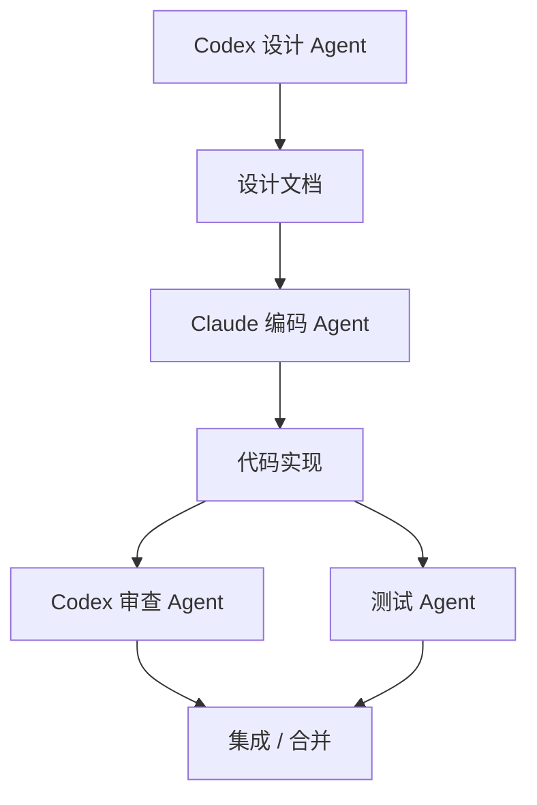

# Claude Agent 角色设计

## 1. Agent 总览

本项目采用“Codex 设计，Claude 编码”的 Agent 协作方式。



## 2. Claude 编码 Agent

### 角色定位

Claude 是实现负责人，按照 Codex 设计文档编写代码。

### 主要职责

- 实现 React 前端功能。
- 实现 FastAPI 后端接口。
- 实现 DeepSeek API 调用。
- 实现 Pydantic 模型、PyYAML 转换和校验逻辑。
- 编写必要测试。
- 根据测试结果修复问题。

### 输入

每次任务应包含：

```text
任务目标
相关文档
允许修改的文件
禁止修改的文件
验收标准
需要运行的命令
```

### 输出

每次任务完成应输出：

```text
修改内容
修改文件列表
运行命令
测试结果
风险和待办
```

## 3. Claude 前端 Agent

### 负责范围

```text
frontend/
```

### 可做事项

- React 页面和组件开发。
- Ant Design 交互控件。
- Monaco Editor 集成。
- axios API 请求封装。
- js-yaml 格式校验。
- 响应式布局调整。

### 必须遵守

- 不使用 Element Plus。
- 不在前端保存 DeepSeek API Key。
- API 请求统一放在 `frontend/src/api/`。
- 页面文本和按钮状态要清晰。
- 修改后运行 `npm run build`。

## 4. Claude 后端 Agent

### 负责范围

```text
backend/
```

### 可做事项

- FastAPI 路由。
- Pydantic 模型。
- DeepSeek 服务封装。
- YAML 转换。
- mock 回退。
- 后端接口测试。

### 必须遵守

- API Key 只从 `.env` 读取。
- DeepSeek 输出先按 JSON 解析。
- AI 输出必须通过 Pydantic 校验。
- 中文 YAML 输出必须正常显示。
- 修改后运行后端冒烟测试。

## 5. Claude 测试 Agent

### 负责范围

```text
frontend tests
backend tests
manual verification
```

### 测试重点

- 前端构建。
- 后端健康检查。
- Schema 接口。
- 生成接口。
- 章节不足 3 个的错误处理。
- 无 API Key 时 mock 回退。
- YAML 格式有效性。

## 6. Claude 文档辅助 Agent

### 可做事项

- 根据代码变化更新 README。
- 根据 API 变化更新 `docs/api-design.md`。
- 根据 Schema 变化更新 `docs/yaml-schema.md`。
- 根据目录变化更新 `docs/project-directory-design.md`。

### 限制

Claude 不应重新定义设计方向。设计类大改应交给 Codex 设计 Agent 先完成。

## 7. Codex 设计 Agent 边界

Codex 负责：

- 需求分析。
- 系统架构。
- 模块拆分。
- 数据库设计。
- API 设计。
- 目录设计。
- 开发规范。
- Agent 设计。
- Claude 任务拆解。
- 代码审查。

Claude 发现设计文档不清晰时，应反馈问题，而不是擅自改设计。

