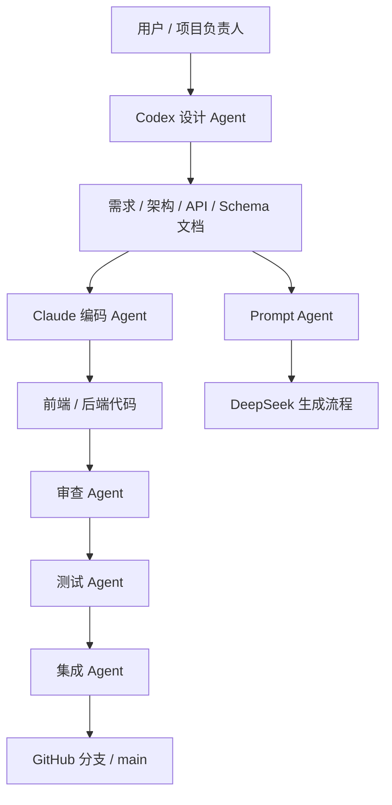
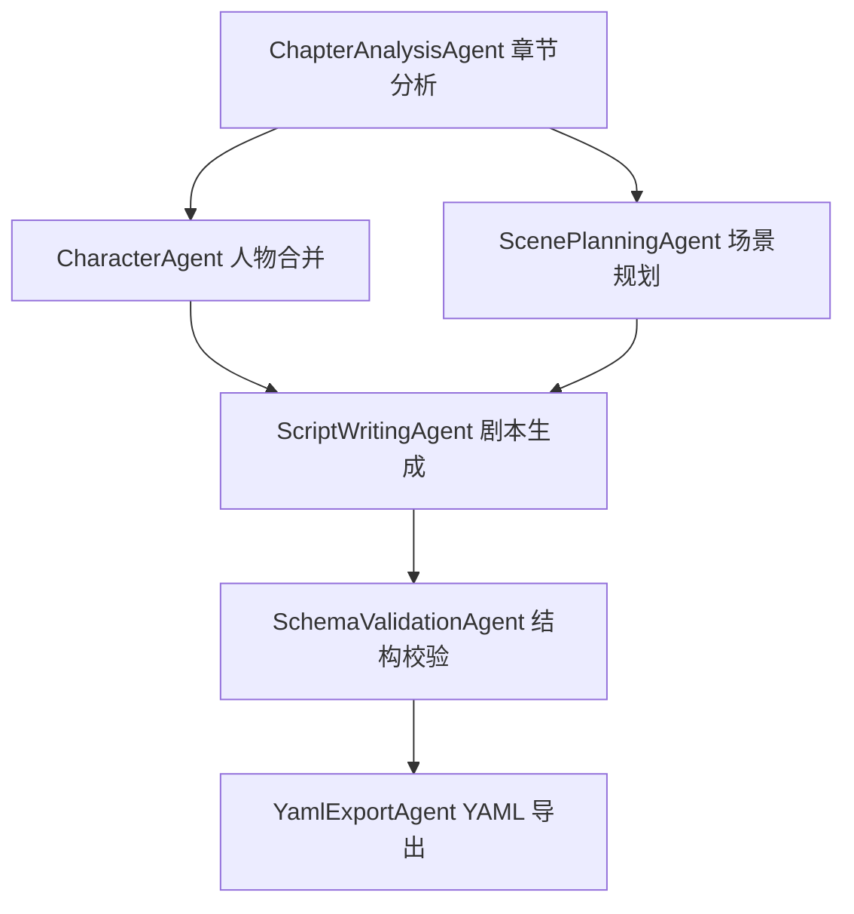

# Agent 设计

## 1. 设计目标

本项目采用“Codex 负责方案设计，Claude 负责代码生成”的协作模式。Agent 设计的目标是把 AI 协作过程拆成清晰的角色、输入、输出和质量门禁，避免不同 AI 工具重复工作、越界修改或生成与设计不一致的代码。

该设计既服务项目开发过程，也服务产品内部的 AI 小说转剧本流程。

核心目标：

- 明确 Codex 与 Claude 的职责边界。
- 定义每类 Agent 的输入、输出和验收标准。
- 保证代码生成前有明确设计文档和接口契约。
- 保证生成代码后有测试、审查和文档同步。
- 降低 AI 输出不稳定、误解需求、修改范围过大的风险。

## 2. Agent 总体架构



Agent 分为两类：

- 开发协作 Agent：用于项目开发过程。
- 产品运行 Agent：用于 Novel2Script 应用内部的小说转剧本流程。

## 3. 开发协作 Agent 分工

| Agent | 推荐工具 | 核心职责 |
| --- | --- | --- |
| 设计 Agent | Codex | 需求分析、架构设计、模块拆分、API、Schema、数据库、目录和规范 |
| 编码 Agent | Claude | 根据设计文档生成前端、后端和测试代码 |
| 审查 Agent | Codex | 检查代码是否符合设计、发现风险和缺陷 |
| 测试 Agent | Claude 或 Codex | 编写和运行测试，验证前后端功能 |
| 集成 Agent | Codex | 分支管理、合并、推送、文档同步和发布检查 |
| Prompt Agent | Codex | 设计 DeepSeek Prompt、输出 Schema 和模型约束 |

## 4. Codex 设计 Agent

### 4.1 角色定位

Codex 设计 Agent 是项目的方案负责人，负责编写和维护项目设计文档。Claude 在写代码前，应以 Codex 产出的设计文档为主要依据。

### 4.2 职责范围

Codex 设计 Agent 负责：

- 需求分析。
- 系统架构设计。
- 模块拆分。
- 数据库设计。
- API 设计。
- 项目目录设计。
- 开发规范。
- YAML Schema 设计。
- AI Prompt 和结构化输出设计。
- 代码生成任务拆分。
- 审查 Claude 生成的代码是否符合设计。

### 4.3 输入

- 用户原始题目和要求。
- 已有项目代码。
- 已有设计文档。
- 当前技术栈约束。
- GitHub 分支流程要求。

### 4.4 输出

- Markdown 设计文档。
- Claude 编码任务说明。
- API 请求/响应契约。
- Pydantic / YAML Schema 说明。
- 验收标准。
- 代码审查意见。

### 4.5 不应承担的工作

- 不直接替代 Claude 完成大规模代码生成，除非用户明确要求。
- 不绕过分支流程直接提交到 `main`。
- 不编造不存在的接口、数据库或部署能力。

## 5. Claude 编码 Agent

### 5.1 角色定位

Claude 编码 Agent 是实现负责人，按照 Codex 设计文档生成具体代码。它的目标不是重新设计系统，而是把已确定的方案稳定落地。

### 5.2 职责范围

Claude 编码 Agent 负责：

- 实现 React 前端页面和组件。
- 实现 FastAPI 后端接口。
- 实现 DeepSeek API 调用。
- 实现 Pydantic 模型和 PyYAML 转换。
- 编写单元测试和接口测试。
- 根据错误日志修复代码。
- 按设计文档补充必要注释。

### 5.3 输入

Claude 每次编码前应收到：

- 任务目标。
- 影响范围。
- 相关设计文档链接。
- 需要修改的文件范围。
- 不允许修改的文件范围。
- 验收标准。
- 要运行的测试命令。

### 5.4 输出

Claude 应输出：

- 代码变更。
- 修改文件列表。
- 运行过的命令。
- 测试结果。
- 未完成事项或风险。

### 5.5 约束

Claude 不应：

- 擅自改变技术栈。
- 擅自修改 API 契约。
- 擅自修改 YAML Schema。
- 把 DeepSeek API Key 写入代码。
- 大范围重构与任务无关的代码。
- 删除已有设计文档。

## 6. 审查 Agent

### 6.1 角色定位

审查 Agent 负责检查 Claude 生成的代码是否符合设计和开发规范。推荐由 Codex 承担。

### 6.2 审查内容

审查重点：

- 是否符合 API 设计。
- 是否符合 YAML Schema。
- 是否遵守目录设计。
- 是否泄露密钥。
- 是否存在前端交互问题。
- 是否存在后端异常处理缺失。
- 是否有测试缺口。
- 是否修改了无关文件。

### 6.3 审查输出格式

审查输出应优先列问题：

```text
问题 1：文件路径 + 行号 + 风险说明 + 修复建议
问题 2：文件路径 + 行号 + 风险说明 + 修复建议

测试情况：
已运行 ...
未运行 ...
```

如果没有明显问题，应说明剩余风险。

## 7. 测试 Agent

### 7.1 角色定位

测试 Agent 负责验证项目是否能运行，以及关键功能是否符合验收标准。

### 7.2 测试范围

前端：

- Vite 构建是否通过。
- 章节数量校验是否有效。
- 生成按钮是否能调用后端。
- YAML 编辑器是否显示结果。
- 复制、下载和 Schema 查看是否可用。

后端：

- `/api/health` 是否返回 200。
- `/api/schema` 是否返回 JSON Schema。
- `/api/generate` 是否接受 3 个以上章节。
- 章节不足 3 个是否返回 422。
- 无 DeepSeek API Key 时是否走 mock。
- YAML 输出是否可解析。

### 7.3 推荐命令

前端：

```bash
cd frontend
npm run build
```

后端：

```bash
cd backend
source .venv/bin/activate
python - <<'PY'
from fastapi.testclient import TestClient
from app.main import app

client = TestClient(app)
assert client.get("/api/health").status_code == 200
assert client.get("/api/schema").status_code == 200

payload = {
    "chapters": [
        {"title": "第一章", "content": "内容一"},
        {"title": "第二章", "content": "内容二"},
        {"title": "第三章", "content": "内容三"},
    ]
}
response = client.post("/api/generate", json=payload)
assert response.status_code == 200
assert "yaml" in response.json()
PY
```

## 8. 集成 Agent

### 8.1 角色定位

集成 Agent 负责 Git 分支流程、提交、合并、推送和部署检查。推荐由 Codex 承担。

### 8.2 工作流程

```text
git checkout main
git pull
git checkout -b feature/<topic>

完成任务
本地验证
git add
git commit
git push -u origin feature/<topic>

git checkout main
git merge --no-ff feature/<topic>
git push
```

### 8.3 合并前检查

- 工作分支是否只包含本任务相关内容。
- README 是否同步文档入口。
- 是否运行必要验证。
- 是否没有提交 `.env`、`.venv`、`node_modules`、`dist`。
- 是否没有破坏 GitHub Pages 配置。

## 9. Prompt Agent

### 9.1 角色定位

Prompt Agent 负责 Novel2Script 内部 DeepSeek Prompt 的设计、维护和评估。

### 9.2 职责范围

- 设计 system prompt。
- 设计 user prompt 模板。
- 约束模型输出合法 JSON。
- 定义人物、地点、场景和 beat 的输出规则。
- 设计失败回退策略。
- 设计示例输入输出。

### 9.3 Prompt 输入输出

输入：

```text
至少 3 个小说章节
```

输出：

```text
符合 ScriptDocument 的 JSON
```

后端再转换为：

```text
YAML 剧本
```

### 9.4 质量要求

Prompt 生成结果必须满足：

- 可以被 JSON 解析。
- 可以通过 Pydantic 校验。
- 包含至少一个场景。
- 场景中包含 beats。
- 人物和地点使用稳定 ID。
- `chapter_refs` 能追溯来源章节。

## 10. 产品运行 Agent 设计

Novel2Script 产品内部可以抽象为一个多阶段 AI 工作流。当前 MVP 使用单次 DeepSeek 调用，后续可演进为多 Agent 流程。

### 10.1 当前 MVP Agent

```text
ScriptGenerationAgent
```

职责：

- 接收 3 个以上章节。
- 构造 Prompt。
- 调用 DeepSeek。
- 返回 ScriptDocument JSON。
- 失败时触发 mock 回退。

当前对应代码：

```text
backend/app/prompts/script_prompt.py
backend/app/services/deepseek_service.py
backend/app/services/mock_service.py
```

### 10.2 后续多 Agent 工作流



#### ChapterAnalysisAgent

职责：

- 按章节提取摘要、人物、地点、事件。
- 降低长文本直接生成带来的上下文压力。

输出：

```json
{
  "chapter_title": "第一章",
  "summary": "...",
  "characters": [],
  "locations": [],
  "events": []
}
```

#### CharacterAgent

职责：

- 合并多章节中重复人物。
- 统一人物 ID。
- 生成角色简介。

#### ScenePlanningAgent

职责：

- 将小说事件拆成剧本场景。
- 规划场景顺序、地点、时间和冲突。

#### ScriptWritingAgent

职责：

- 根据场景规划生成 action、dialogue、narration、transition、sound、shot。
- 保持剧本可编辑，而不是只输出故事摘要。

#### SchemaValidationAgent

职责：

- 检查输出是否符合 ScriptDocument。
- 发现缺字段、类型错误、ID 引用错误。

#### YamlExportAgent

职责：

- 将通过校验的结构化剧本转换为 YAML。
- 保证中文正常显示和字段顺序稳定。

## 11. Agent 输入输出契约

### 11.1 开发协作契约

Codex 给 Claude 的任务应包含：

```text
任务名称：
目标：
相关文档：
允许修改的文件：
禁止修改的文件：
实现要求：
验收标准：
需要运行的命令：
输出要求：
```

### 11.2 示例任务

```text
任务名称：实现后端 YAML 校验接口

目标：
新增 POST /api/validate-yaml，接收 YAML 文本并返回是否符合 ScriptDocument。

相关文档：
- docs/api-design.md
- docs/yaml-schema.md
- docs/development-standards.md

允许修改的文件：
- backend/app/main.py
- backend/app/models.py
- backend/app/services/yaml_service.py

禁止修改的文件：
- frontend/
- docs/yaml-schema.md

验收标准：
- 合法 YAML 返回 valid=true
- 非法 YAML 返回 valid=false 和错误信息
- 不破坏现有 /api/generate

需要运行：
- 后端 TestClient 冒烟测试
```

## 12. Agent 安全边界

所有 Agent 必须遵守：

- 不泄露 DeepSeek API Key。
- 不把用户小说正文完整写入日志。
- 不删除用户已有代码或文档。
- 不越过当前任务范围大规模重构。
- 不直接信任 AI 输出，必须通过 Schema 校验。
- 不把模型生成内容作为可执行代码运行。

## 13. Agent 交付标准

每次 Agent 任务完成后，应交付：

- 修改内容摘要。
- 修改文件列表。
- 验证命令和结果。
- 已知风险。
- 是否需要后续 Agent 接力。

如果是设计类任务，还应交付：

- 设计文档路径。
- GitHub 链接。
- 对应 README 入口。

如果是编码类任务，还应交付：

- 启动方式。
- 测试结果。
- 对接口或 Schema 的影响。

## 14. 本项目推荐协作流程

```text
1. 用户提出阶段任务
2. Codex 设计 Agent 输出设计文档
3. Codex 创建 feature 分支并推送设计
4. Claude 编码 Agent 根据文档实现代码
5. 测试 Agent 验证构建和接口
6. Codex 审查 Agent 做代码审查
7. 集成 Agent 合并分支并推送 main
```

这种流程适合当前项目，因为它把“设计”和“实现”分开，既能发挥 Codex 的方案组织能力，也能利用 Claude 的代码生成能力。

