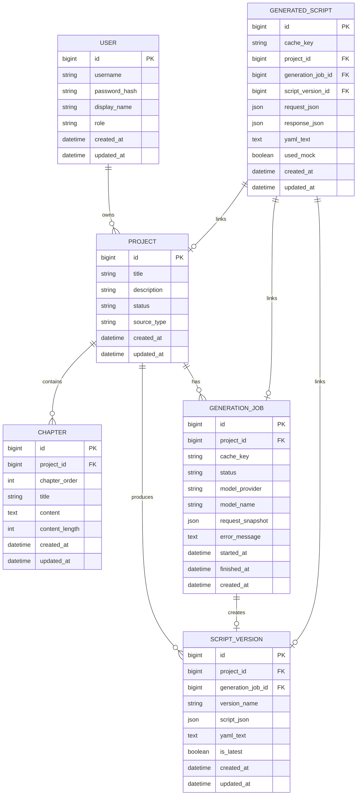

# 数据库设计

## 1. 设计定位

当前版本的 Novel2Script 已引入“Redis 生成缓存 + MySQL 生成结果持久化”。用户输入章节后，后端会先根据章节内容和生成选项计算缓存键，命中 Redis 时直接返回历史剧本；未命中时生成剧本，并将结果写入 Redis 和 MySQL。

当前数据库已经保存用户、小说项目、章节、生成任务、剧本版本和生成缓存记录。Redis 只保留 Session 与生成结果缓存，不作为业务内容的唯一存储。

当前数据库：

```text
MySQL 8.x
```

选择原因：

- MySQL 在本地 Docker 和课程项目中部署简单。
- MySQL JSON 字段可保存请求快照和结构化响应。
- YAML 输出使用 LONGTEXT 保存，避免大文本截断。
- Redis 负责高频重复请求命中，MySQL 负责持久化和 Redis 丢失后的恢复。

## 2. 数据库目标

数据库需要支持以下能力：

- 保存用户创建的小说项目。
- 保存登录用户。
- 保存 3 个以上章节文本。
- 记录每次 AI 生成任务的状态和错误信息。
- 保存结构化剧本 JSON 和 YAML 输出。
- 对相同章节和生成选项做请求去重。
- Redis 未命中时可从 MySQL 恢复历史生成结果。
- 支持一个小说项目生成多个剧本版本。
- 支持后续导出、审计、回滚和继续编辑。

仍然不进入数据库的内容：

- Redis Session ID：短期登录态，继续由 Redis 管理。
- Redis 生成缓存：加速重复请求，MySQL 才是持久化来源。
- DeepSeek API Key：只保存在服务端 `.env`。
- 前端临时编辑状态：用户未提交或未生成的草稿暂不持久化。
- 支付、团队和多人协作数据：当前版本未实现。

## 3. 核心实体



## 4. 表结构设计

### 4.1 users（当前已实现）

保存登录用户。系统启动时会根据 `.env` 中的 `DEMO_USERNAME` 和 `DEMO_PASSWORD` 自动创建默认演示用户。

| 字段 | 类型 | 约束 | 说明 |
| --- | --- | --- | --- |
| id | BIGINT UNSIGNED | PK, AUTO_INCREMENT | 用户 ID |
| username | VARCHAR(64) | UNIQUE, NOT NULL | 登录用户名 |
| password_hash | VARCHAR(255) | NOT NULL | PBKDF2 哈希后的密码 |
| display_name | VARCHAR(100) | NOT NULL | 展示名 |
| role | VARCHAR(32) | NOT NULL | 用户角色 |
| created_at | TIMESTAMP | NOT NULL | 创建时间 |
| updated_at | TIMESTAMP | NOT NULL | 更新时间 |

设计原因：

- 用户账号属于长期业务数据，应进入 MySQL。
- 密码不能明文保存，因此只保存 PBKDF2 哈希。
- Session ID 仍保存在 Redis，因为它是短期登录态。

### 4.2 generated_scripts（当前已实现）

保存 `/api/generate` 的请求快照和生成结果。

| 字段 | 类型 | 约束 | 说明 |
| --- | --- | --- | --- |
| id | BIGINT UNSIGNED | PK, AUTO_INCREMENT | 自增主键 |
| cache_key | VARCHAR(96) | UNIQUE, NOT NULL | `chapters + options` 的 SHA-256 缓存键 |
| project_id | BIGINT UNSIGNED | NULL | 关联项目 |
| generation_job_id | BIGINT UNSIGNED | NULL | 关联生成任务 |
| script_version_id | BIGINT UNSIGNED | NULL | 关联剧本版本 |
| request_json | JSON | NOT NULL | 请求快照 |
| response_json | JSON | NOT NULL | 后端返回给前端的完整响应 |
| yaml_text | LONGTEXT | NOT NULL | 生成出的 YAML 文本 |
| used_mock | BOOLEAN | NOT NULL | 是否为 mock 回退结果 |
| created_at | TIMESTAMP | NOT NULL | 创建时间 |
| updated_at | TIMESTAMP | NOT NULL | 更新时间 |

索引：

| 索引 | 字段 | 说明 |
| --- | --- | --- |
| UNIQUE | cache_key | 相同请求只保存一份结果 |
| idx_generated_scripts_created_at | created_at | 方便按时间排查生成记录 |

设计原因：

- `cache_key` 保证重复生成请求可以快速定位历史结果。
- `request_json` 保存输入，便于追溯生成来源。
- `response_json` 保存完整响应，Redis 缓存失效后可直接恢复前端需要的数据。
- `yaml_text` 单独冗余保存，方便未来做下载、搜索或导出。

### 4.3 projects（当前已实现）

保存一个小说改编项目。

| 字段 | 类型 | 约束 | 说明 |
| --- | --- | --- | --- |
| id | BIGINT UNSIGNED | PK, AUTO_INCREMENT | 项目 ID |
| title | VARCHAR(200) | NOT NULL | 项目标题 |
| description | TEXT | NULL | 项目说明 |
| status | VARCHAR(32) | NOT NULL | draft、generating、completed、archived |
| source_type | VARCHAR(32) | NOT NULL | generate_request 等来源 |
| created_at | TIMESTAMP | NOT NULL | 创建时间 |
| updated_at | TIMESTAMP | NOT NULL | 更新时间 |

设计原因：

- `project` 是章节、生成任务和剧本版本的聚合根。
- 每次新的生成请求会创建一个项目，用于承载章节、任务和版本。

### 4.4 chapters（当前已实现）

保存小说章节。

| 字段 | 类型 | 约束 | 说明 |
| --- | --- | --- | --- |
| id | BIGINT UNSIGNED | PK, AUTO_INCREMENT | 章节 ID |
| project_id | BIGINT UNSIGNED | FK, NOT NULL | 所属项目 |
| chapter_order | INT | NOT NULL | 章节顺序 |
| title | VARCHAR(255) | NOT NULL | 章节标题 |
| content | LONGTEXT | NOT NULL | 章节正文 |
| content_length | INT | NOT NULL | 正文长度 |
| created_at | TIMESTAMP | NOT NULL | 创建时间 |
| updated_at | TIMESTAMP | NOT NULL | 更新时间 |

约束建议：

```sql
UNIQUE (project_id, chapter_order)
```

设计原因：

- 题目要求输入 3 个章节以上，因此章节必须单独建表。
- `chapter_order` 保证模型处理时能恢复原文顺序。
- `content_length` 便于后续做长文本限制、费用估算和分块处理。

### 4.5 generation_jobs（当前已实现）

记录一次 AI 生成任务。

| 字段 | 类型 | 约束 | 说明 |
| --- | --- | --- | --- |
| id | BIGINT UNSIGNED | PK, AUTO_INCREMENT | 生成任务 ID |
| project_id | BIGINT UNSIGNED | FK, NOT NULL | 所属项目 |
| cache_key | VARCHAR(96) | NOT NULL | 生成缓存键 |
| status | VARCHAR(30) | NOT NULL | pending、running、success、failed、mocked |
| model_provider | VARCHAR(50) | NOT NULL | deepseek |
| model_name | VARCHAR(100) | NOT NULL | deepseek-chat |
| request_json | JSON | NOT NULL | 生成时的章节和参数快照 |
| used_mock | BOOLEAN | NOT NULL | 是否 mock 回退 |
| started_at | TIMESTAMP | NOT NULL | 开始时间 |
| finished_at | TIMESTAMP | NULL | 完成时间 |
| created_at | TIMESTAMP | NOT NULL | 创建时间 |

设计原因：

- AI 调用存在失败、超时和回退，因此需要任务表记录生成过程。
- `request_json` 保存生成时的输入快照，避免章节被修改后无法追溯当时生成依据。
- `used_mock` 用于记录是否走演示回退生成。

### 4.6 script_versions（当前已实现）

保存剧本版本。

| 字段 | 类型 | 约束 | 说明 |
| --- | --- | --- | --- |
| id | BIGINT UNSIGNED | PK, AUTO_INCREMENT | 剧本版本 ID |
| project_id | BIGINT UNSIGNED | FK, NOT NULL | 所属项目 |
| generation_job_id | BIGINT UNSIGNED | FK, NOT NULL | 来源生成任务 |
| version_name | VARCHAR(100) | NOT NULL | 版本名，如 v1、人工修改版 |
| script_json | JSON | NOT NULL | 结构化剧本对象 |
| yaml_text | LONGTEXT | NOT NULL | YAML 剧本文本 |
| is_latest | BOOLEAN | NOT NULL | 是否最新版本 |
| created_at | TIMESTAMP | NOT NULL | 创建时间 |
| updated_at | TIMESTAMP | NOT NULL | 更新时间 |

设计原因：

- `script_json` 便于系统继续做结构化编辑和校验。
- `yaml_text` 保留用户看到和下载的最终文本。
- 一个项目可能多次生成或人工修改，因此需要版本表，而不是只在项目表保存一个结果。

### 4.7 export_records（后续扩展）

记录剧本导出行为。

| 字段 | 类型 | 约束 | 说明 |
| --- | --- | --- | --- |
| id | BIGINT UNSIGNED | PK, AUTO_INCREMENT | 导出记录 ID |
| script_version_id | BIGINT UNSIGNED | FK, NOT NULL | 来源剧本版本 |
| export_format | VARCHAR(30) | NOT NULL | yaml、json、txt、docx |
| file_name | VARCHAR(255) | NOT NULL | 导出文件名 |
| exported_at | TIMESTAMP | NOT NULL | 导出时间 |

设计原因：

- 当前只支持 YAML 下载，后续可能支持 JSON、TXT、DOCX 或剧本软件格式。
- 导出记录可以用于审计、最近导出和文件管理。

## 5. 建表方式

当前项目没有引入 Alembic。FastAPI 启动时会由两个 Repository 自动执行兼容性建表：

| Repository | 创建/维护的表 |
| --- | --- |
| `MySQLUserRepository` | `users` |
| `MySQLGenerationRepository` | `projects`、`chapters`、`generation_jobs`、`script_versions`、`generated_scripts` |

`generated_scripts` 是已有表，代码会用增量方式补充 `project_id`、`generation_job_id`、`script_version_id` 三个关联字段，因此旧数据不会被删除。

后续生产化建议引入 Alembic 或 Flyway 管理正式 migration 文件。

## 6. 索引设计

| 表 | 索引 | 用途 |
| --- | --- | --- |
| chapters | `(project_id, chapter_order)` | 按项目顺序读取章节 |
| generation_jobs | `(project_id, created_at DESC)` | 查询项目生成历史 |
| generation_jobs | `(status, created_at)` | 后续异步任务队列查询 |
| script_versions | `(project_id, created_at DESC)` | 查询项目剧本版本 |
| generated_scripts | `UNIQUE(cache_key)` | 重复请求去重 |
| generated_scripts | `(created_at)` | 排查和统计生成记录 |

设计原则：

- 索引围绕实际查询路径建立，不盲目给所有字段加索引。
- 章节读取依赖项目和顺序，因此 `(project_id, chapter_order)` 是核心索引。
- 剧本版本常见查询是“某项目最新版本”和“某项目历史版本”。

## 7. 数据流设计

### 7.1 创建项目与章节

```text
用户输入章节
  -> 创建 projects
  -> 批量创建 chapters
  -> 校验章节数量 >= 3
```

### 7.2 生成剧本

```text
前端提交章节
  -> 计算 cache_key
  -> Redis 命中则直接返回
  -> MySQL generated_scripts 命中则返回并回填 Redis
  -> 调用 DeepSeek / mock fallback
  -> 创建 projects
  -> 批量创建 chapters
  -> 创建 generation_jobs(status=success)
  -> 创建 script_versions
  -> 写入 generated_scripts
  -> 写入 Redis
```

如果 AI 调用失败：

```text
记录 error_message
  -> status=failed
  -> 可选：写入 mocked 任务和演示版本
```

### 7.3 编辑剧本

```text
用户修改 YAML
  -> 前端校验 YAML 格式
  -> 后端解析 YAML
  -> Pydantic 校验
  -> 创建新的 script_versions
  -> 设置旧版本 is_latest=false
  -> 设置新版本 is_latest=true
```

设计原因：编辑不覆盖旧版本，而是创建新版本，便于回滚和对比。

## 8. 与当前代码的关系

当前代码的数据流：

```text
前端输入章节
  -> POST /api/generate
  -> 后端计算 generation cache_key
  -> Redis 命中：直接返回
  -> MySQL 命中：返回并回填 Redis
  -> 未命中：调用 DeepSeek / mock fallback
  -> 写入 Redis
  -> 写入 MySQL projects / chapters / generation_jobs / script_versions / generated_scripts
  -> 返回 YAML
```

## 9. 隐私与安全设计

小说文本和生成剧本属于用户创作内容，应按敏感数据处理。

安全原则：

- 不保存 DeepSeek API Key 到数据库。
- `.env` 只存放在服务端环境。
- 生产环境应限制单次上传文本长度。
- 生产环境应对用户输入和模型输出做日志脱敏。
- 如引入账号系统，所有 project 查询必须按 user_id 隔离。
- 删除项目时级联删除章节、任务、版本和导出记录。

后续如果添加多人协作，需要新增：

```text
project_members
```

并在 `projects` 表中增加：

```text
owner_id
```

## 10. 备份与恢复

本地开发阶段：

- 使用 `mysqldump` 导出 MySQL 数据库。

生产阶段：

- MySQL 开启每日自动备份。
- 高价值用户作品应支持导出 YAML 作为离线备份。
- 数据恢复后需要验证 `projects -> chapters -> script_versions` 关系完整。

## 11. 迁移与回滚策略

数据库迁移应遵循：

- 优先使用添加字段、添加表等兼容性变更。
- 删除字段和重命名字段应拆成多次发布。
- 大字段回填应分批执行，避免长事务。
- 索引创建应尽量使用在线方式。

推荐迁移流程：

```text
编写 Alembic migration
  -> 本地 MySQL 测试
  -> 备份数据库
  -> 执行迁移
  -> 验证表结构和关键查询
  -> 发布应用代码
```

回滚策略：

- 表新增类迁移可以通过删除新表回滚。
- 字段新增类迁移可以保留字段，先回滚应用代码。
- 删除数据类操作必须提前备份，不与普通代码发布混在一起。

## 12. 后续扩展表

当项目从课程演示升级为完整产品时，可继续扩展：

| 表 | 用途 |
| --- | --- |
| users | 用户账号 |
| project_members | 多人协作 |
| character_cards | 独立人物设定卡 |
| location_cards | 独立场景地点卡 |
| prompt_templates | 多种改编风格 Prompt |
| quality_reports | 剧本质量评估结果 |
| edit_history | YAML 编辑历史 |
| comments | 协作批注 |

这些扩展不应一次性加入当前 MVP，避免数据库复杂度过高。
