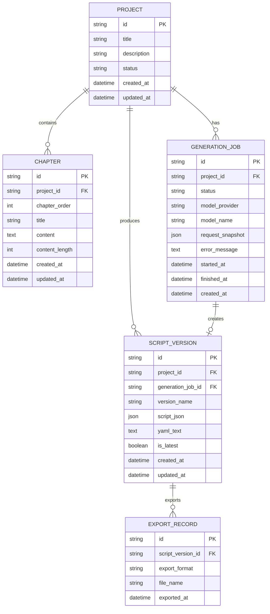

# 数据库设计

## 1. 设计定位

当前版本的 Novel2Script 以“本地运行 + 即时生成 + YAML 下载”为主，核心功能不强制依赖数据库。用户输入章节后，后端调用 DeepSeek API 生成剧本并直接返回给前端，前端负责展示、编辑和下载。

但是如果项目继续扩展为在线工具，就需要保存用户作品、章节、生成任务、剧本版本和导出记录。因此本数据库设计采用“当前可不落库，未来可扩展落库”的方式，作为后续开发的数据库蓝图。

推荐数据库：

```text
开发阶段：SQLite
生产阶段：PostgreSQL
```

选择原因：

- SQLite 适合本地演示和快速开发，部署成本低。
- PostgreSQL 适合后续在线化，支持 JSONB、全文检索、事务和复杂索引。
- 剧本内容同时包含结构化字段和大段文本，PostgreSQL 的 JSONB 能很好地保存 AI 生成的结构化结果。

## 2. 数据库目标

数据库需要支持以下能力：

- 保存用户创建的小说项目。
- 保存 3 个以上章节文本。
- 记录每次 AI 生成任务的状态和错误信息。
- 保存结构化剧本 JSON 和 YAML 输出。
- 支持一个小说项目生成多个剧本版本。
- 支持后续导出、审计、回滚和继续编辑。

非目标：

- 当前版本不实现用户账号系统。
- 当前版本不实现多人协作。
- 当前版本不保存 DeepSeek API Key。
- 当前版本不保存支付、权限和团队数据。

## 3. 核心实体



## 4. 表结构设计

### 4.1 projects

保存一个小说改编项目。

| 字段 | 类型 | 约束 | 说明 |
| --- | --- | --- | --- |
| id | UUID / TEXT | PK | 项目 ID |
| title | VARCHAR(200) | NOT NULL | 项目标题 |
| description | TEXT | NULL | 项目说明 |
| status | VARCHAR(30) | NOT NULL | draft、generating、completed、archived |
| created_at | TIMESTAMP | NOT NULL | 创建时间 |
| updated_at | TIMESTAMP | NOT NULL | 更新时间 |

设计原因：

- `project` 是章节、生成任务和剧本版本的聚合根。
- 即使当前无账号系统，也可以先围绕项目组织数据。

### 4.2 chapters

保存小说章节。

| 字段 | 类型 | 约束 | 说明 |
| --- | --- | --- | --- |
| id | UUID / TEXT | PK | 章节 ID |
| project_id | UUID / TEXT | FK, NOT NULL | 所属项目 |
| chapter_order | INTEGER | NOT NULL | 章节顺序 |
| title | VARCHAR(200) | NOT NULL | 章节标题 |
| content | TEXT | NOT NULL | 章节正文 |
| content_length | INTEGER | NOT NULL | 正文长度 |
| created_at | TIMESTAMP | NOT NULL | 创建时间 |
| updated_at | TIMESTAMP | NOT NULL | 更新时间 |

约束建议：

```sql
UNIQUE (project_id, chapter_order)
```

设计原因：

- 题目要求输入 3 个章节以上，因此章节必须单独建表。
- `chapter_order` 保证模型处理时能恢复原文顺序。
- `content_length` 便于后续做长文本限制、费用估算和分块处理。

### 4.3 generation_jobs

记录一次 AI 生成任务。

| 字段 | 类型 | 约束 | 说明 |
| --- | --- | --- | --- |
| id | UUID / TEXT | PK | 生成任务 ID |
| project_id | UUID / TEXT | FK, NOT NULL | 所属项目 |
| status | VARCHAR(30) | NOT NULL | pending、running、success、failed、mocked |
| model_provider | VARCHAR(50) | NOT NULL | deepseek |
| model_name | VARCHAR(100) | NOT NULL | deepseek-chat |
| request_snapshot | JSON / JSONB | NOT NULL | 生成时的章节和参数快照 |
| error_message | TEXT | NULL | 失败原因 |
| started_at | TIMESTAMP | NULL | 开始时间 |
| finished_at | TIMESTAMP | NULL | 完成时间 |
| created_at | TIMESTAMP | NOT NULL | 创建时间 |

设计原因：

- AI 调用存在失败、超时和回退，因此需要任务表记录生成过程。
- `request_snapshot` 保存生成时的输入快照，避免章节被修改后无法追溯当时生成依据。
- `mocked` 状态用于记录演示回退生成。

### 4.4 script_versions

保存剧本版本。

| 字段 | 类型 | 约束 | 说明 |
| --- | --- | --- | --- |
| id | UUID / TEXT | PK | 剧本版本 ID |
| project_id | UUID / TEXT | FK, NOT NULL | 所属项目 |
| generation_job_id | UUID / TEXT | FK, NULL | 来源生成任务 |
| version_name | VARCHAR(100) | NOT NULL | 版本名，如 v1、人工修改版 |
| script_json | JSON / JSONB | NOT NULL | 结构化剧本对象 |
| yaml_text | TEXT | NOT NULL | YAML 剧本文本 |
| is_latest | BOOLEAN | NOT NULL | 是否最新版本 |
| created_at | TIMESTAMP | NOT NULL | 创建时间 |
| updated_at | TIMESTAMP | NOT NULL | 更新时间 |

设计原因：

- `script_json` 便于系统继续做结构化编辑和校验。
- `yaml_text` 保留用户看到和下载的最终文本。
- 一个项目可能多次生成或人工修改，因此需要版本表，而不是只在项目表保存一个结果。

约束建议：

```sql
-- PostgreSQL 可用部分唯一索引保证每个项目只有一个最新版本
CREATE UNIQUE INDEX idx_script_versions_latest
ON script_versions(project_id)
WHERE is_latest = true;
```

### 4.5 export_records

记录剧本导出行为。

| 字段 | 类型 | 约束 | 说明 |
| --- | --- | --- | --- |
| id | UUID / TEXT | PK | 导出记录 ID |
| script_version_id | UUID / TEXT | FK, NOT NULL | 来源剧本版本 |
| export_format | VARCHAR(30) | NOT NULL | yaml、json、txt、docx |
| file_name | VARCHAR(255) | NOT NULL | 导出文件名 |
| exported_at | TIMESTAMP | NOT NULL | 导出时间 |

设计原因：

- 当前只支持 YAML 下载，后续可能支持 JSON、TXT、DOCX 或剧本软件格式。
- 导出记录可以用于审计、最近导出和文件管理。

## 5. SQL 建表示例

以下 SQL 以 PostgreSQL 为目标数据库。

```sql
CREATE TABLE projects (
  id UUID PRIMARY KEY,
  title VARCHAR(200) NOT NULL,
  description TEXT,
  status VARCHAR(30) NOT NULL DEFAULT 'draft',
  created_at TIMESTAMP NOT NULL DEFAULT CURRENT_TIMESTAMP,
  updated_at TIMESTAMP NOT NULL DEFAULT CURRENT_TIMESTAMP
);

CREATE TABLE chapters (
  id UUID PRIMARY KEY,
  project_id UUID NOT NULL REFERENCES projects(id) ON DELETE CASCADE,
  chapter_order INTEGER NOT NULL,
  title VARCHAR(200) NOT NULL,
  content TEXT NOT NULL,
  content_length INTEGER NOT NULL,
  created_at TIMESTAMP NOT NULL DEFAULT CURRENT_TIMESTAMP,
  updated_at TIMESTAMP NOT NULL DEFAULT CURRENT_TIMESTAMP,
  UNIQUE (project_id, chapter_order)
);

CREATE TABLE generation_jobs (
  id UUID PRIMARY KEY,
  project_id UUID NOT NULL REFERENCES projects(id) ON DELETE CASCADE,
  status VARCHAR(30) NOT NULL DEFAULT 'pending',
  model_provider VARCHAR(50) NOT NULL DEFAULT 'deepseek',
  model_name VARCHAR(100) NOT NULL DEFAULT 'deepseek-chat',
  request_snapshot JSONB NOT NULL,
  error_message TEXT,
  started_at TIMESTAMP,
  finished_at TIMESTAMP,
  created_at TIMESTAMP NOT NULL DEFAULT CURRENT_TIMESTAMP
);

CREATE TABLE script_versions (
  id UUID PRIMARY KEY,
  project_id UUID NOT NULL REFERENCES projects(id) ON DELETE CASCADE,
  generation_job_id UUID REFERENCES generation_jobs(id) ON DELETE SET NULL,
  version_name VARCHAR(100) NOT NULL,
  script_json JSONB NOT NULL,
  yaml_text TEXT NOT NULL,
  is_latest BOOLEAN NOT NULL DEFAULT false,
  created_at TIMESTAMP NOT NULL DEFAULT CURRENT_TIMESTAMP,
  updated_at TIMESTAMP NOT NULL DEFAULT CURRENT_TIMESTAMP
);

CREATE TABLE export_records (
  id UUID PRIMARY KEY,
  script_version_id UUID NOT NULL REFERENCES script_versions(id) ON DELETE CASCADE,
  export_format VARCHAR(30) NOT NULL,
  file_name VARCHAR(255) NOT NULL,
  exported_at TIMESTAMP NOT NULL DEFAULT CURRENT_TIMESTAMP
);

CREATE UNIQUE INDEX idx_script_versions_latest
ON script_versions(project_id)
WHERE is_latest = true;
```

## 6. 索引设计

| 表 | 索引 | 用途 |
| --- | --- | --- |
| chapters | `(project_id, chapter_order)` | 按项目顺序读取章节 |
| generation_jobs | `(project_id, created_at DESC)` | 查询项目生成历史 |
| generation_jobs | `(status, created_at)` | 后续异步任务队列查询 |
| script_versions | `(project_id, created_at DESC)` | 查询项目剧本版本 |
| script_versions | `(project_id) WHERE is_latest = true` | 快速读取最新版本 |
| export_records | `(script_version_id, exported_at DESC)` | 查询导出历史 |

设计原则：

- 索引围绕实际查询路径建立，不盲目给所有字段加索引。
- 章节读取依赖项目和顺序，因此 `(project_id, chapter_order)` 是核心索引。
- 剧本版本常见查询是“某项目最新版本”和“某项目历史版本”。

## 7. 数据流设计

### 7.1 创建项目与章节

```text
用户输入章节
  -> 创建 projects
  -> 批量创建 chapters
  -> 校验章节数量 >= 3
```

### 7.2 生成剧本

```text
读取项目章节
  -> 创建 generation_jobs(status=running)
  -> 调用 DeepSeek
  -> Pydantic 校验结构
  -> 写入 script_versions
  -> 更新 generation_jobs(status=success)
```

如果 AI 调用失败：

```text
记录 error_message
  -> status=failed
  -> 可选：写入 mocked 任务和演示版本
```

### 7.3 编辑剧本

```text
用户修改 YAML
  -> 前端校验 YAML 格式
  -> 后端解析 YAML
  -> Pydantic 校验
  -> 创建新的 script_versions
  -> 设置旧版本 is_latest=false
  -> 设置新版本 is_latest=true
```

设计原因：编辑不覆盖旧版本，而是创建新版本，便于回滚和对比。

## 8. 与当前代码的关系

当前代码是无数据库 MVP：

```text
前端输入章节
  -> POST /api/generate
  -> 后端即时生成
  -> 直接返回 YAML
```

未来引入数据库后，可以新增这些后端模块：

```text
backend/app/db/
  session.py
  models.py
  migrations/

backend/app/repositories/
  project_repository.py
  chapter_repository.py
  generation_job_repository.py
  script_version_repository.py

backend/app/services/
  project_service.py
  script_version_service.py
```

建议 ORM：

```text
SQLAlchemy 2.x + Alembic
```

引入顺序：

1. 新增数据库连接和迁移工具。
2. 新增 `projects` 和 `chapters`。
3. 新增 `generation_jobs`。
4. 新增 `script_versions`。
5. 新增 `export_records`。
6. 将 `/api/generate` 从纯即时接口扩展为可保存项目和版本。

## 9. 隐私与安全设计

小说文本和生成剧本属于用户创作内容，应按敏感数据处理。

安全原则：

- 不保存 DeepSeek API Key 到数据库。
- `.env` 只存放在服务端环境。
- 生产环境应限制单次上传文本长度。
- 生产环境应对用户输入和模型输出做日志脱敏。
- 如引入账号系统，所有 project 查询必须按 user_id 隔离。
- 删除项目时级联删除章节、任务、版本和导出记录。

后续如果添加用户系统，需要新增：

```text
users
project_members
```

并在 `projects` 表中增加：

```text
owner_id
```

## 10. 备份与恢复

本地开发阶段：

- SQLite 文件定期复制备份即可。

生产阶段：

- PostgreSQL 开启每日自动备份。
- 高价值用户作品应支持导出 YAML 作为离线备份。
- 数据恢复后需要验证 `projects -> chapters -> script_versions` 关系完整。

## 11. 迁移与回滚策略

数据库迁移应遵循：

- 优先使用添加字段、添加表等兼容性变更。
- 删除字段和重命名字段应拆成多次发布。
- 大字段回填应分批执行，避免长事务。
- 索引创建应尽量使用在线方式。

推荐迁移流程：

```text
编写 Alembic migration
  -> 本地 SQLite/PostgreSQL 测试
  -> 备份数据库
  -> 执行迁移
  -> 验证表结构和关键查询
  -> 发布应用代码
```

回滚策略：

- 表新增类迁移可以通过删除新表回滚。
- 字段新增类迁移可以保留字段，先回滚应用代码。
- 删除数据类操作必须提前备份，不与普通代码发布混在一起。

## 12. 后续扩展表

当项目从课程演示升级为完整产品时，可继续扩展：

| 表 | 用途 |
| --- | --- |
| users | 用户账号 |
| project_members | 多人协作 |
| character_cards | 独立人物设定卡 |
| location_cards | 独立场景地点卡 |
| prompt_templates | 多种改编风格 Prompt |
| quality_reports | 剧本质量评估结果 |
| edit_history | YAML 编辑历史 |
| comments | 协作批注 |

这些扩展不应一次性加入当前 MVP，避免数据库复杂度过高。

