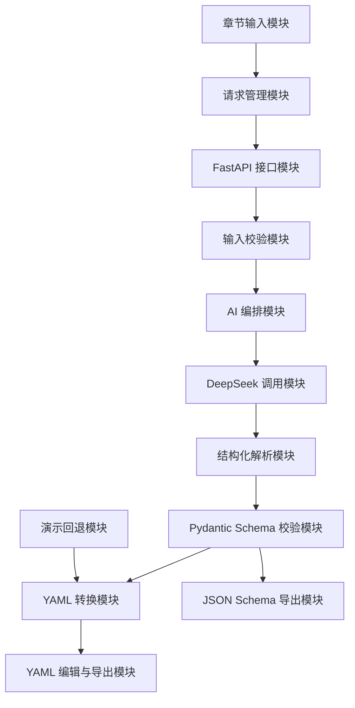

# 模块拆分设计

## 1. 拆分目标

模块拆分的目标是把 Novel2Script 从“一个能运行的工具”拆成边界清晰、职责明确、便于实现和答辩说明的功能模块。每个模块都应该能回答三个问题：

- 它负责什么？
- 它接收什么输入、产生什么输出？
- 它依赖哪些其他模块？

本项目采用前后端分离架构，因此模块拆分分为前端模块、后端模块、AI 编排模块、Schema 与文档模块、部署与工程模块。

## 2. 模块总览



## 3. 前端模块

前端模块位于 `frontend/src/`，主要面向作者和演示用户，提供章节输入、生成操作、YAML 展示、下载和 Schema 查看能力。

### 3.1 应用入口模块

路径：

```text
frontend/src/main.jsx
frontend/src/App.jsx
```

职责：

- 初始化 React 应用。
- 配置 Tailwind CSS 全局样式、shadcn/ui 组件主题和 motion 动效基础能力。
- 组织页面整体布局。
- 管理核心页面状态。

核心状态：

| 状态 | 含义 |
| --- | --- |
| chapters | 用户输入的章节数组 |
| yamlText | 当前 YAML 输出 |
| loading | 是否正在生成 |
| usedMock | 是否使用后端演示回退 |
| schemaText | 后端 JSON Schema 文本 |
| schemaOpen | Schema 弹窗是否打开 |

输入：无外部输入，由浏览器加载页面触发。  
输出：完整工具页面。

### 3.2 章节输入模块

当前实现位置：

```text
frontend/src/App.jsx
```

职责：

- 展示章节列表。
- 支持添加章节。
- 支持删除章节。
- 支持编辑章节标题和正文。
- 保证最少 3 个章节。

输入：

```json
[
  {
    "title": "第一章 雨夜",
    "content": "小说正文..."
  }
]
```

输出：符合后端请求格式的 `chapters` 数组。

后续可拆分为独立组件：

```text
frontend/src/components/ChapterList.jsx
frontend/src/components/ChapterCard.jsx
```

### 3.3 前端校验模块

当前实现位置：

```text
frontend/src/App.jsx
```

职责：

- 检查章节数量是否不少于 3 个。
- 检查章节标题和正文是否为空。
- 在调用后端前阻止无效请求。

设计原因：前端校验可以减少无效请求，提高用户体验。但后端仍需保留同样的校验，因为前端校验不能作为安全边界。

### 3.4 API 请求模块

路径：

```text
frontend/src/api/scriptApi.js
frontend/src/api/authApi.js
```

职责：

- 统一配置后端 API 地址。
- 封装 `/api/generate` 请求。
- 封装 `/api/schema` 请求。
- 封装 `/api/validate-yaml` 请求。
- 封装登录、当前用户查询和退出登录请求。

主要函数：

| 函数 | 说明 |
| --- | --- |
| generateScript(chapters) | 提交章节并获取剧本 YAML |
| fetchSchema() | 获取后端导出的 JSON Schema |
| validateYaml(yamlText) | 校验 YAML 语法和 ScriptDocument Schema |
| login(username, password) | 登录并写入 HttpOnly Cookie |
| checkAuth() | 检查当前 Session 是否有效 |
| logout() | 清除服务端 Session 和浏览器 Cookie |

输入：章节数据或无参数。  
输出：后端 JSON 响应。

### 3.5 YAML 编辑与导出模块

当前实现位置：

```text
frontend/src/App.jsx
```

依赖：

```text
@monaco-editor/react
js-yaml
```

职责：

- 使用 Monaco Editor 展示 YAML。
- 支持用户直接编辑生成结果。
- 使用 js-yaml 校验 YAML 格式。
- 支持复制到剪贴板。
- 支持下载为 `script-output.yaml`。

设计原因：题目强调“可编辑、可进一步打磨”，因此输出区不能只是纯文本展示，而应该允许作者继续修改。

### 3.6 Schema 查看模块

当前实现位置：

```text
frontend/src/App.jsx
```

职责：

- 调用后端 `/api/schema`。
- 在弹窗中展示 JSON Schema。
- 帮助开发者和评审理解 YAML 的结构来源。

## 4. 后端模块

后端模块位于 `backend/app/`，负责 API、数据校验、AI 调用、结构化解析和 YAML 转换。

### 4.1 API 路由模块

路径：

```text
backend/app/main.py
```

职责：

- 创建 FastAPI 应用。
- 配置 CORS。
- 暴露 `/api/health`、`/api/schema`、`/api/generate`。
- 串联后端各服务模块。

接口：

| 接口 | 方法 | 职责 |
| --- | --- | --- |
| /api/health | GET | 服务健康检查 |
| /api/schema | GET | 导出 ScriptDocument JSON Schema |
| /api/generate | POST | 根据章节生成剧本 YAML |
| /api/validate-yaml | POST | 校验 YAML 是否符合 ScriptDocument Schema |
| /api/auth/login | POST | 登录并创建 Session |
| /api/auth/me | GET | 查询当前登录状态 |
| /api/auth/logout | POST | 退出登录并删除 Session |

### 4.1.1 认证与 Session 模块

路径：

```text
backend/app/auth.py
backend/app/session_store.py
```

职责：

- 提供登录、当前用户查询和退出登录接口。
- 使用 HttpOnly Cookie 保存 session id。
- 使用 Redis 保存 Session 数据。
- Redis 不可用时回退到内存存储，保证本地演示可用。

### 4.2 配置管理模块

路径：

```text
backend/app/config.py
backend/.env.example
```

职责：

- 读取 DeepSeek API Key。
- 读取 DeepSeek Base URL。
- 读取模型名称。
- 读取允许跨域访问的前端地址。

核心配置：

```env
DEEPSEEK_API_KEY=
DEEPSEEK_BASE_URL=https://api.deepseek.com
DEEPSEEK_MODEL=deepseek-chat
FRONTEND_ORIGIN=http://localhost:5173
```

设计原因：API Key 不应写死在代码中，也不应出现在前端。

### 4.3 数据模型模块

路径：

```text
backend/app/models.py
```

职责：

- 定义前端请求模型。
- 定义剧本结构模型。
- 定义后端响应模型。
- 提供 JSON Schema 导出基础。

核心模型：

| 模型 | 职责 |
| --- | --- |
| NovelChapter | 单个小说章节 |
| GenerateRequest | 剧本生成请求 |
| ScriptMetadata | 剧本元信息 |
| ScriptSource | 原小说来源信息 |
| Character | 人物 |
| Location | 地点 |
| Beat | 场景节拍 |
| Scene | 场景 |
| ScriptDocument | 完整剧本 |
| GenerateResponse | 生成接口响应 |

### 4.4 Prompt 模板模块

路径：

```text
backend/app/prompts/script_prompt.py
```

职责：

- 定义 DeepSeek 的 system prompt。
- 根据章节内容生成 user prompt。
- 约束模型只输出 JSON。
- 约束剧本结构字段。

输入：`list[NovelChapter]`。  
输出：发送给 DeepSeek 的 prompt 字符串。

### 4.5 DeepSeek 调用模块

路径：

```text
backend/app/services/deepseek_service.py
```

职责：

- 构造 DeepSeek Chat Completions 请求。
- 发送模型调用。
- 提取模型返回内容。
- 从文本中解析 JSON。
- 将 JSON 校验为 `ScriptDocument`。

输入：小说章节和配置。  
输出：`ScriptDocument` 对象。

异常：

- 未配置 API Key。
- HTTP 请求失败。
- DeepSeek 返回错误码。
- 返回内容无法解析为 JSON。
- JSON 不符合 Pydantic 模型。

### 4.6 YAML 转换模块

路径：

```text
backend/app/services/yaml_service.py
```

职责：

- 将 `ScriptDocument` 转为 Python dict。
- 使用 PyYAML 输出 YAML。
- 保留中文字符。
- 保持字段顺序。

输入：`ScriptDocument`。  
输出：YAML 字符串。

### 4.7 演示回退模块

路径：

```text
backend/app/services/mock_service.py
```

职责：

- 在未配置 DeepSeek API Key 或模型调用失败时返回示例剧本。
- 保证系统在答辩、离线或 API 失败时仍可演示。
- 使用用户输入章节标题填充 `source.chapter_titles`。

输入：章节标题数组。  
输出：`ScriptDocument` 示例对象。

## 5. AI 编排模块

AI 编排不是单独的文件，而是由 Prompt 模板、DeepSeek 调用、JSON 提取、Pydantic 校验、YAML 转换共同组成。

流程：

```text
章节输入
  -> 构造 Prompt
  -> DeepSeek 输出 JSON
  -> extract_json 解析
  -> ScriptDocument 校验
  -> PyYAML 转换
  -> 返回前端
```

模块边界：

| 步骤 | 所属模块 |
| --- | --- |
| 章节输入校验 | GenerateRequest / 前端校验 |
| Prompt 生成 | prompts/script_prompt.py |
| 模型调用 | services/deepseek_service.py |
| 结构校验 | models.py |
| YAML 转换 | services/yaml_service.py |
| 回退演示 | services/mock_service.py |

## 6. Schema 与文档模块

路径：

```text
docs/
  requirements-analysis.md
  system-architecture.md
  module-breakdown.md
  yaml-schema.md
```

职责：

- 需求分析说明项目为什么做。
- 系统架构说明系统怎么做。
- 模块拆分说明系统由哪些部分组成。
- YAML Schema 说明输出结构和设计原因。

Schema 来源：

```text
backend/app/models.py
  -> Pydantic model_json_schema()
  -> /api/schema
  -> docs/yaml-schema.md 人工解释
```

设计原因：代码模型负责机器校验，Markdown 文档负责人类理解，二者互相补充。

## 7. 部署与工程模块

### 7.1 GitHub 托管模块

职责：

- 托管完整项目代码。
- 使用分支隔离每个功能文档或功能模块。
- 完成后合并到 `main`。

推荐分支命名：

```text
feature/module-breakdown
feature/frontend-editor
feature/backend-deepseek
docs/schema-design
```

### 7.2 GitHub Pages 前端部署模块

路径：

```text
frontend/package.json
frontend/vite.config.js
```

职责：

- `vite.config.js` 配置 `base: '/novel-to-script/'`。
- `npm run deploy` 构建并发布到 `gh-pages` 分支。

### 7.3 本地后端运行模块

职责：

- 使用 FastAPI 在本地运行后端。
- 通过 `.env` 配置 DeepSeek API Key。
- 默认监听 `http://localhost:8000`。

## 8. 模块依赖关系

```text
前端章节输入模块
  依赖 API 请求模块

API 请求模块
  依赖 FastAPI 接口模块

FastAPI 接口模块
  依赖 Pydantic 数据模型模块
  依赖 DeepSeek 调用模块
  依赖 YAML 转换模块
  依赖 演示回退模块

DeepSeek 调用模块
  依赖 配置管理模块
  依赖 Prompt 模板模块
  依赖 Pydantic 数据模型模块

Schema 文档模块
  依赖 Pydantic 数据模型模块
```

## 9. 后续组件化建议

当前前端为了快速交付，主要逻辑集中在 `App.jsx`。如果继续开发，建议拆分为：

```text
frontend/src/components/
  AppHeader.jsx
  ChapterList.jsx
  ChapterCard.jsx
  YamlWorkspace.jsx
  SchemaModal.jsx
  ActionToolbar.jsx
```

后端如果继续扩展长文本处理，建议新增：

```text
backend/app/services/
  chapter_analysis_service.py
  character_merge_service.py
  scene_planning_service.py
  retry_service.py
```

这样可以支持“分章分析 -> 全局汇总 -> 场景规划 -> 剧本生成”的多阶段 AI 工作流。

## 10. 模块验收标准

| 模块 | 验收标准 |
| --- | --- |
| 章节输入模块 | 能输入、添加、删除章节，且不少于 3 章 |
| 登录模块 | 能登录、刷新保持登录态、退出后清除 Session |
| API 请求模块 | 能正确请求 `/api/generate`、`/api/schema`、`/api/validate-yaml` 和认证接口 |
| FastAPI 接口模块 | `/api/health`、`/api/schema`、`/api/generate`、`/api/validate-yaml` 和认证接口可用 |
| DeepSeek 调用模块 | 配置 API Key 后能调用模型并返回结构化结果 |
| Schema 校验模块 | AI 结果必须通过 Pydantic 校验 |
| YAML 转换模块 | 输出合法 YAML，中文正常显示 |
| 演示回退模块 | 无 API Key 时系统仍可生成演示 YAML |
| 文档模块 | 需求、架构、模块、Schema 文档齐全 |
| 部署模块 | 前端可构建并发布到 GitHub Pages |
