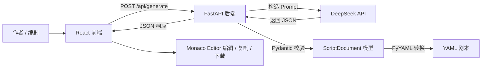
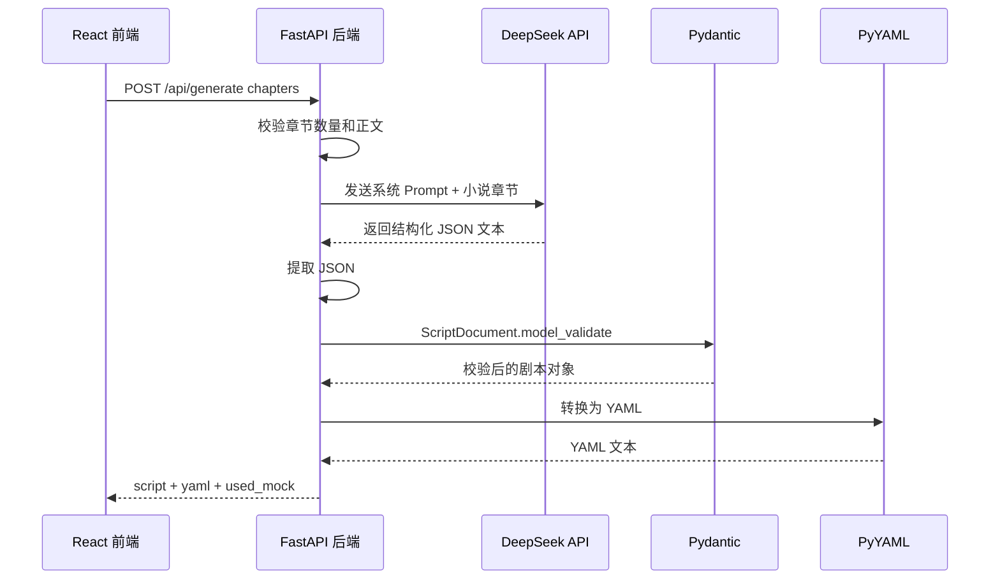
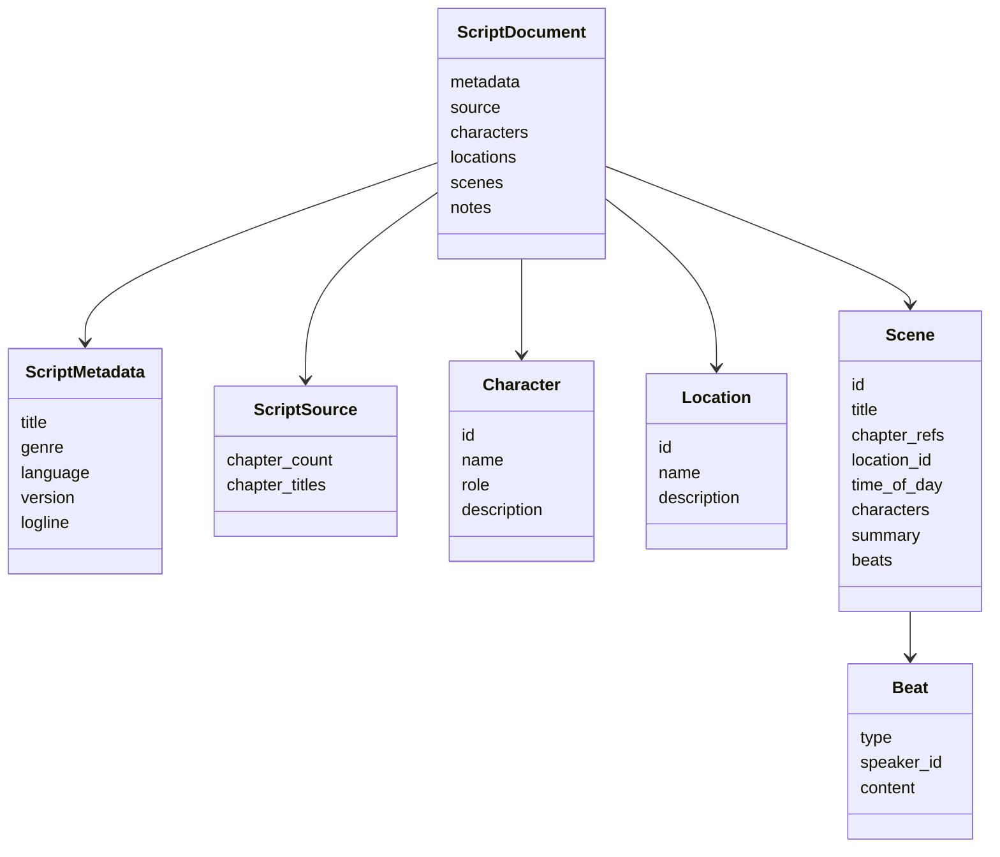
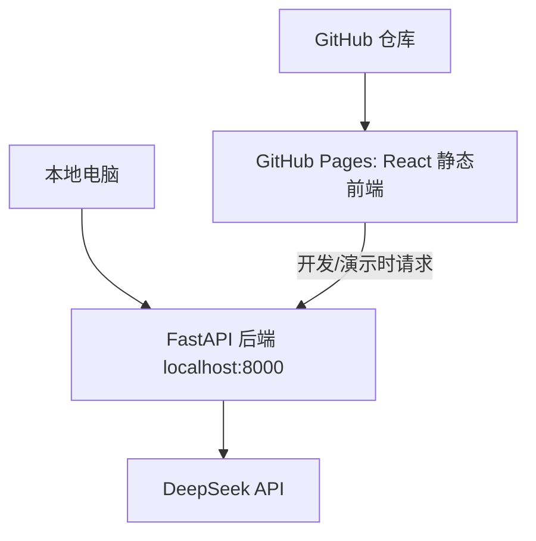

# 系统架构设计（How）

## 1. 架构目标

Novel2Script 的系统架构目标是把“多章节小说输入”稳定转换为“可编辑、可校验、可下载的 YAML 剧本初稿”。架构设计重点不是简单调用一次大模型，而是将前端交互、后端校验、AI 生成、结构化转换和部署方式拆清楚，保证项目可运行、可维护、可演示。

核心设计目标：

- 前后端分离，前端负责编辑体验，后端负责 AI 编排和结构校验。
- AI 输出先约束为 JSON，再由程序转换为 YAML，降低 YAML 缩进错误风险。
- 使用 Pydantic 作为后端事实 Schema，保证运行时校验、JSON Schema 导出和文档保持一致。
- 本地优先运行，GitHub 托管代码，GitHub Pages 部署前端。
- 未配置 DeepSeek API Key 时仍可返回演示结果，保证答辩和演示稳定。

## 2. 总体架构



系统采用三层结构：

| 层级 | 技术 | 职责 |
| --- | --- | --- |
| 表现层 | React + Vite + Ant Design + Monaco Editor | 章节输入、状态提示、YAML 展示、复制下载 |
| 应用层 | FastAPI + Pydantic + PyYAML | 请求校验、AI 编排、结构校验、YAML 转换 |
| AI 能力层 | DeepSeek API | 小说理解、人物抽取、场景拆分、剧本生成 |

## 3. 前端架构

前端位于 `frontend/`，采用 Vite 构建 React 单页应用。

```text
frontend/
  src/
    api/
      scriptApi.js
    App.jsx
    main.jsx
    styles.css
```

### 3.1 前端职责

前端只处理用户交互和展示，不直接调用 DeepSeek API。这样可以避免 API Key 暴露在浏览器中。

前端主要职责：

- 管理章节列表，支持添加、删除和编辑章节。
- 在生成前校验章节数量必须不少于 3 个。
- 调用 FastAPI 后端 `/api/generate`。
- 使用 Monaco Editor 展示和编辑 YAML。
- 使用 js-yaml 做轻量格式校验。
- 支持复制和下载 YAML 文件。
- 调用 `/api/schema` 查看后端导出的 JSON Schema。

### 3.2 前端状态设计

```text
chapters      当前章节数组
yamlText      当前 YAML 输出文本
loading       是否正在生成
usedMock      后端是否返回演示结果
schemaText    JSON Schema 内容
schemaOpen    Schema 弹窗状态
```

设计原因：状态全部保存在页面组件中，当前版本不需要全局状态管理。这样实现简单，便于维护，也符合单页工具型项目的规模。

## 4. 后端架构

后端位于 `backend/`，采用 FastAPI 提供 REST API。

```text
backend/
  app/
    main.py
    models.py
    config.py
    prompts/
      script_prompt.py
    services/
      deepseek_service.py
      mock_service.py
      yaml_service.py
```

### 4.1 后端模块职责

| 文件 | 职责 |
| --- | --- |
| main.py | FastAPI 应用入口，定义 API 路由和 CORS |
| models.py | Pydantic 数据模型，定义请求、响应和剧本结构 |
| config.py | 读取 DeepSeek API Key、模型名、前端地址等配置 |
| prompts/script_prompt.py | 管理系统提示词和用户提示词模板 |
| services/deepseek_service.py | 调用 DeepSeek API，提取和解析 JSON |
| services/yaml_service.py | 将 ScriptDocument 转换为 YAML |
| services/mock_service.py | 无 API Key 或模型失败时返回演示剧本 |

### 4.2 后端接口设计

#### GET /api/health

用于检查服务是否可用。

响应示例：

```json
{
  "status": "ok",
  "service": "novel2script-api"
}
```

#### GET /api/schema

返回由 `ScriptDocument` Pydantic 模型导出的 JSON Schema。该接口为未来前端自动校验、编辑器提示和第三方系统接入保留扩展能力。

#### POST /api/generate

输入小说章节，输出剧本对象和 YAML 文本。

请求示例：

```json
{
  "chapters": [
    {
      "title": "第一章 雨夜",
      "content": "小说正文..."
    },
    {
      "title": "第二章 手稿",
      "content": "小说正文..."
    },
    {
      "title": "第三章 旧书店",
      "content": "小说正文..."
    }
  ]
}
```

响应示例：

```json
{
  "script": {},
  "yaml": "metadata:\n  title: ...",
  "used_mock": false
}
```

`used_mock` 用于告诉前端当前是否使用了演示数据。

## 5. AI 生成流程

系统不让 DeepSeek 直接输出 YAML，而是采用“JSON 中间结构”。



### 5.1 为什么不直接输出 YAML

YAML 对缩进、列表层级和特殊字符更敏感，大模型直接输出 YAML 时容易出现解析失败。JSON 更适合作为模型结构化输出格式，后端可以先用 Pydantic 校验字段，再用 PyYAML 生成稳定 YAML。

### 5.2 Prompt 设计

Prompt 分为两部分：

- System Prompt：定义模型角色和输出约束。
- User Prompt：提供章节文本、剧本结构和字段要求。

Prompt 明确要求：

- 只输出合法 JSON。
- 按场景拆分内容。
- 使用稳定 ID 引用人物、地点和场景。
- 使用 `beats` 表达 action、dialogue、narration、transition、sound、shot。
- 保留 `chapter_refs`，方便追溯原小说章节。

## 6. 数据模型设计

核心模型是 `ScriptDocument`。



设计原因：

- `metadata` 独立存放，便于版本管理和文件展示。
- `source` 记录章节来源，保证改编结果可追溯。
- `characters` 和 `locations` 独立建表，避免在多个场景中重复描述。
- `scenes` 是剧本的核心结构，方便作者按场修改。
- `beats` 是场景内部最小可编辑单位，适合表达动作、对白、旁白和转场。

## 7. 异常与回退设计

AI 调用存在三类常见失败：

- 未配置 DeepSeek API Key。
- 网络超时或 API 返回错误。
- 模型返回内容无法通过 JSON 解析或 Pydantic 校验。

当前系统采用演示回退策略：当 DeepSeek 调用失败时，后端返回 `mock_service.py` 中的示例剧本，并设置 `used_mock=true`。前端收到后展示提示，保证系统在答辩或本地演示时不会因为外部 API 不可用而完全失败。

后续生产化可以将策略改为：

- 对模型输出进行一次自动修复重试。
- 返回明确错误并保留用户输入。
- 对长章节进行分章摘要后再生成总剧本。

## 8. 安全设计

DeepSeek API Key 只存放在后端 `.env` 中，前端不保存、不展示、不传输 API Key。

当前安全边界：

- 浏览器只访问 FastAPI。
- FastAPI 代替前端调用 DeepSeek。
- `.env` 被 `.gitignore` 忽略，不提交到 GitHub。
- 仓库只提交 `.env.example` 作为配置模板。

需要注意：当前版本主要用于本地运行和课程演示，没有用户登录、权限隔离和服务端持久化。若部署到公网，需要增加限流、鉴权、日志脱敏和请求大小限制。

## 9. 部署架构



部署方式：

- GitHub 托管完整代码。
- GitHub Pages 部署 `frontend/dist` 静态资源。
- FastAPI 后端本地运行在 `http://localhost:8000`。
- 前端通过 `VITE_API_BASE_URL` 或默认地址访问后端。

设计原因：GitHub Pages 不能运行 Python 服务，因此前端静态部署和后端本地运行分开处理。该方案实现成本低，适合课程项目和本地演示。

## 10. 可扩展设计

后续可以按以下方向扩展：

- 长文本处理：分章摘要、全局人物合并、分场生成。
- 质量评估：检查人物是否一致、场景是否缺少冲突、对白是否过长。
- 多版本改稿：保存不同 YAML 版本并做差异对比。
- 剧本编辑器：基于 YAML Schema 做表单化编辑。
- 云端部署：将 FastAPI 部署到 Render、Railway、Fly.io 或云服务器。
- GitHub Actions：加入前端构建和后端测试自动化。

## 11. 架构决策记录

### ADR-001：采用前后端分离

状态：已采纳

原因：前端需要较强编辑体验，后端需要安全保存 API Key 和校验 AI 输出。前后端分离可以让职责更清晰。

备选方案：纯前端调用 DeepSeek。该方案会暴露 API Key，不适合实际项目。

### ADR-002：DeepSeek 输出 JSON，后端转换 YAML

状态：已采纳

原因：JSON 更适合结构化生成和 Pydantic 校验，YAML 更适合最终交付和人工编辑。

备选方案：DeepSeek 直接输出 YAML。该方案实现简单，但容易出现缩进错误和解析失败。

### ADR-003：Pydantic 作为 Schema 源

状态：已采纳

原因：Pydantic 同时支持运行时校验和 JSON Schema 导出，可以减少“代码 Schema”和“文档 Schema”不一致的问题。

备选方案：手写 JSON Schema。该方案更标准，但与后端模型容易重复维护。

