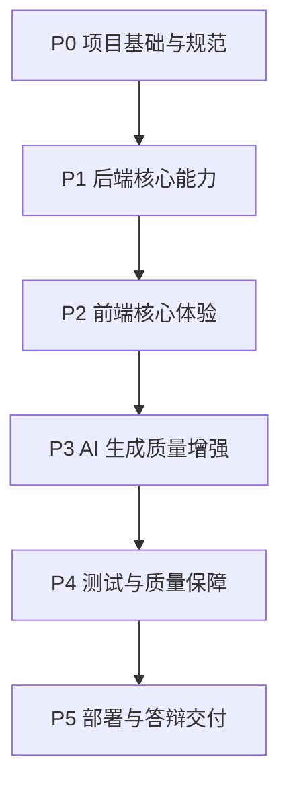

# 任务拆分

## 1. 拆分目标

本任务拆分用于指导 Novel2Script 后续开发。项目采用“Codex 负责设计方案，Claude 负责生成代码”的协作方式，因此任务需要足够清晰、边界明确、可独立验收，避免 Claude 在实现时重新设计系统或修改无关内容。

拆分原则：

- 一个任务只完成一个明确目标。
- 每个任务都说明输入文档、修改范围和验收标准。
- 优先保证 MVP 可运行，再做增强功能。
- 前端、后端、文档、测试、部署分阶段推进。
- API 和 YAML Schema 变更必须同步文档和示例。

## 2. 阶段总览



| 阶段 | 目标 | 状态 |
| --- | --- | --- |
| P0 | 项目骨架、文档、规范、Claude 工作区 | 已基本完成 |
| P1 | 后端接口、DeepSeek、Schema、YAML | 已有 MVP，可增强 |
| P2 | 前端输入、生成、编辑、下载 | 已有 MVP，可组件化 |
| P3 | AI 长文本、Prompt、输出修复 | 待实现 |
| P4 | 自动化测试、质量检查 | 待实现 |
| P5 | GitHub Pages、README、演示材料 | 部分完成 |

## 3. P0 项目基础与规范

### T0.1 初始化项目仓库

目标：创建 GitHub 仓库并初始化前后端目录。

当前状态：已完成。

产出：

- GitHub 仓库。
- `frontend/`
- `backend/`
- `docs/`
- `examples/`
- `.claude/`

### T0.2 完成设计文档

目标：建立完整设计资料，作为 Claude 编码依据。

当前状态：已完成。

文档：

- `docs/requirements-analysis.md`
- `docs/system-architecture.md`
- `docs/module-breakdown.md`
- `docs/database-design.md`
- `docs/api-design.md`
- `docs/project-directory-design.md`
- `docs/development-standards.md`
- `docs/agent-design.md`
- `docs/yaml-schema.md`

### T0.3 完成 Claude 工作区

目标：让 Claude 能基于 `.claude/` 中的指令进行代码生成。

当前状态：已完成。

文件：

- `.claude/project-instructions.md`
- `.claude/agents.md`
- `.claude/task-template.md`
- `.claude/review-checklist.md`
- `.claude/prompt-agent.md`

## 4. P1 后端核心能力

### T1.1 完善后端错误响应格式

目标：将 FastAPI 默认错误逐步统一为项目自定义错误格式。

相关文档：

- `docs/api-design.md`
- `docs/development-standards.md`

允许修改：

- `backend/app/main.py`
- `backend/app/models.py`
- `backend/app/services/`

实现要求：

- 新增统一错误响应模型。
- DeepSeek 调用失败时返回明确错误或 mock 标记。
- 保留 FastAPI 参数校验能力。

验收标准：

- `/api/generate` 章节不足 3 个仍返回 422。
- AI 失败时前端能显示清晰提示。
- 不破坏当前 `GenerateResponse`。

### T1.2 新增 YAML 校验接口

目标：新增 `POST /api/validate-yaml`，用于校验用户编辑后的 YAML 是否符合 `ScriptDocument`。

相关文档：

- `docs/api-design.md`
- `docs/yaml-schema.md`

允许修改：

- `backend/app/main.py`
- `backend/app/models.py`
- `backend/app/services/yaml_service.py`
- `frontend/src/api/scriptApi.js`

请求示例：

```json
{
  "yaml": "metadata:\n  title: ..."
}
```

响应示例：

```json
{
  "valid": true,
  "errors": []
}
```

验收标准：

- 合法 YAML 返回 `valid=true`。
- 非法 YAML 返回 `valid=false` 和错误信息。
- YAML 合法但不符合 Schema 时返回 `valid=false`。

### T1.3 增强 DeepSeek JSON 修复能力

目标：当 DeepSeek 返回 Markdown 包裹或 JSON 前后带解释文字时，尽量提取合法 JSON。

当前已有：

- `extract_json` 基础实现。

增强要求：

- 支持 ```json 代码块。
- 支持前后说明文字。
- 解析失败时抛出明确错误。
- 不执行模型返回内容中的任何代码。

允许修改：

- `backend/app/services/deepseek_service.py`

验收标准：

- 给定纯 JSON、代码块 JSON、前后带文字 JSON 都能解析。
- 非 JSON 内容明确失败。

### T1.4 新增生成选项

目标：支持用户指定剧本类型、风格和目标场景数量。

请求扩展：

```json
{
  "chapters": [],
  "options": {
    "genre": "悬疑",
    "style": "短剧",
    "target_scene_count": 8,
    "language": "zh-CN"
  }
}
```

允许修改：

- `backend/app/models.py`
- `backend/app/prompts/script_prompt.py`
- `frontend/src/App.jsx`

验收标准：

- 旧请求不带 `options` 仍可用。
- 新选项会进入 Prompt。
- 不破坏现有 YAML Schema。

## 5. P2 前端核心体验

### T2.1 前端组件化

目标：将当前集中在 `App.jsx` 的页面拆分为组件。

建议新增：

```text
frontend/src/components/
  AppHeader.jsx
  ChapterCard.jsx
  ChapterList.jsx
  YamlWorkspace.jsx
  SchemaModal.jsx
  ActionToolbar.jsx
```

允许修改：

- `frontend/src/App.jsx`
- `frontend/src/components/`
- `frontend/src/styles.css`

验收标准：

- 页面功能不变。
- `npm run build` 通过。
- 组件职责清晰。

### T2.2 增加 YAML 后端校验按钮

目标：前端接入 `POST /api/validate-yaml`。

依赖任务：

- T1.2

允许修改：

- `frontend/src/api/scriptApi.js`
- `frontend/src/App.jsx` 或 `YamlWorkspace.jsx`

验收标准：

- 点击校验按钮调用后端。
- 合法 YAML 显示成功。
- 非法 YAML 显示错误详情。

### T2.3 增加生成选项面板

目标：前端支持剧本类型、风格、目标场景数等选项。

依赖任务：

- T1.4

建议字段：

- `genre`
- `style`
- `target_scene_count`
- `language`

验收标准：

- 选项能随 `/api/generate` 提交。
- 不填写选项仍可生成。
- UI 不遮挡、不拥挤。

### T2.4 优化 GitHub Pages 提示

目标：前端部署到 GitHub Pages 后，如果本地后端未启动，给出明确提示。

允许修改：

- `frontend/src/App.jsx`
- `frontend/src/api/scriptApi.js`

验收标准：

- 后端不可用时提示“请启动本地 FastAPI 后端”。
- 不显示晦涩网络错误。

## 6. P3 AI 生成质量增强

### T3.1 分章分析服务

目标：为长文本支持做准备，先按章节生成摘要、人物、地点和事件。

建议新增：

```text
backend/app/services/chapter_analysis_service.py
```

输出结构：

```json
{
  "chapter_title": "第一章",
  "summary": "...",
  "characters": [],
  "locations": [],
  "events": []
}
```

验收标准：

- 章节分析输出可被 Pydantic 校验。
- 后续可作为剧本生成输入。

### T3.2 人物与地点合并服务

目标：合并多章节重复人物和地点，生成稳定 ID。

建议新增：

```text
backend/app/services/entity_merge_service.py
```

验收标准：

- 同名人物不重复生成多个 ID。
- 地点名称相同或高度相似时可合并。
- 输出可用于 `ScriptDocument.characters` 和 `locations`。

### T3.3 剧本生成多阶段工作流

目标：将单次 Prompt 改为多阶段流程。

流程：

```text
分章分析
  -> 人物地点合并
  -> 场景规划
  -> 剧本生成
  -> Schema 校验
  -> YAML 导出
```

验收标准：

- 短文本仍可快速生成。
- 长文本更稳定。
- 失败时能定位是哪个阶段失败。

## 7. P4 测试与质量保障

### T4.1 后端测试

目标：新增后端测试目录和基础测试。

建议新增：

```text
backend/tests/
  test_health.py
  test_schema.py
  test_generate.py
  test_yaml_service.py
```

验收标准：

- 健康检查测试通过。
- Schema 接口测试通过。
- 生成接口 mock 回退测试通过。
- YAML 转换和校验测试通过。

### T4.2 前端构建与基础交互测试

目标：建立前端基础质量门禁。

可选技术：

- Vitest
- React Testing Library

验收标准：

- `npm run build` 通过。
- 章节不足 3 个时不能提交。
- 生成按钮 loading 状态可测试。

### T4.3 GitHub Actions

目标：新增 CI，自动验证前端构建和后端测试。

建议新增：

```text
.github/workflows/frontend-build.yml
.github/workflows/backend-test.yml
```

验收标准：

- PR 或 push 时自动运行。
- 前端构建失败会阻止合并。
- 后端测试失败会阻止合并。

## 8. P5 部署与答辩交付

### T5.1 完善 README

目标：让老师或评审可以直接运行项目。

补充内容：

- 项目截图或页面说明。
- 后端启动步骤。
- 前端启动步骤。
- DeepSeek API Key 配置方式。
- GitHub Pages 地址。
- 常见问题。

验收标准：

- 从空环境按 README 能启动项目。
- 说明 GitHub Pages 只部署前端。

### T5.2 准备演示脚本

目标：为答辩准备演示流程。

建议新增：

```text
docs/demo-script.md
```

内容：

- 项目一句话介绍。
- 输入示例小说。
- 点击生成。
- 展示 YAML。
- 展示 Schema 文档。
- 展示 Claude/Codex 协作设计。

### T5.3 准备验收清单

目标：对照题目要求确认完成度。

建议新增：

```text
docs/acceptance-checklist.md
```

验收项：

- 支持 3 章以上输入。
- 输出 YAML。
- YAML 有 Schema 文档。
- Schema 有设计原因。
- 前后端可运行。
- GitHub 已托管。
- 前端可 GitHub Pages 访问。

## 9. Claude 优先任务顺序

如果现在让 Claude 开始编码，推荐顺序：

1. T1.2 新增 YAML 校验接口。
2. T2.1 前端组件化。
3. T2.2 增加 YAML 后端校验按钮。
4. T1.4 新增生成选项。
5. T2.3 增加生成选项面板。
6. T4.1 后端测试。
7. T4.3 GitHub Actions。
8. T5.2 准备演示脚本。

理由：

- YAML 校验能强化题目要求。
- 组件化能让前端更像完整项目。
- 生成选项能体现可编辑、可打磨的创作工具属性。
- 测试和 CI 能提高工程完整度。

## 10. 每个任务的交付要求

Claude 每完成一个任务，应输出：

```text
完成内容：
- ...

修改文件：
- ...

验证：
- 已运行 ...
- 结果 ...

风险/待办：
- ...
```

Codex 后续审查时重点检查：

- 是否符合设计文档。
- 是否越界修改。
- 是否通过测试。
- 是否需要同步 API、Schema 或 README。

